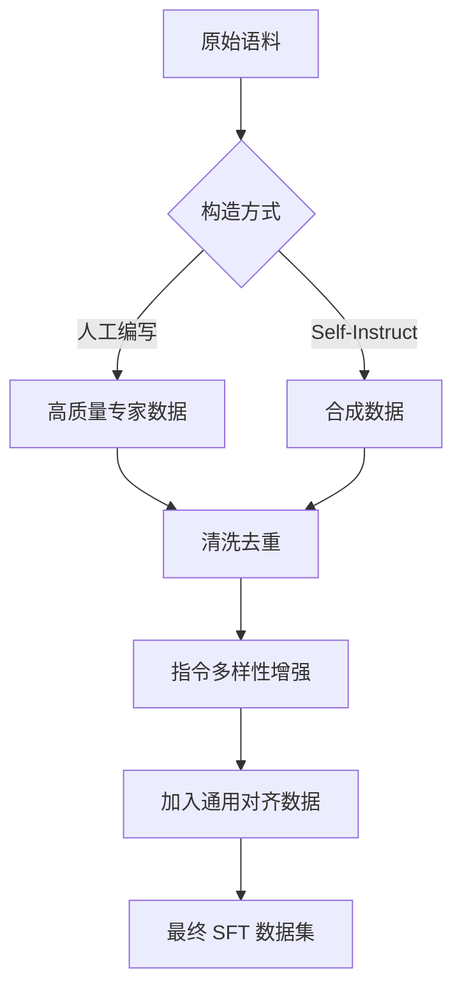

<h1> 大模型（LLMs）有监督微调（SFT）面</h1>   
<h2>一、概念篇    </h2>

<h3>💡从零训练一个大模型有哪几个核心步骤？      </h3>


从零开始训练一个大语言模型（LLM）是一个极其复杂的系统工程，主要可以划分为以下 **6 个核心阶段**。我们可以通过数学定义和工程实例来深入理解。

---

### 1. 数据工程（Data Engineering）

这是“炼丹”的第一步，数据的质量直接决定了模型的天花板。

* **核心动作**：
* **清洗（Cleaning）**：去除 HTML 标签、乱码、有害信息。
* **去重（De-deduplication）**：使用 MinHash 或 LSH 算法剔除互联网中高度重复的内容，防止模型“死记硬背”。
* **Tokenization**：训练分词器（如 Byte-Pair Encoding, BPE），将文本转化为数字序列。


* **生动例子**：这就像是在给大脑准备教材。如果教材里全是错别字（脏数据）或者同一篇课文印了 100 遍（重复数据），大脑就会变得迟钝。

### 2. 模型架构设计（Architecture Design）

目前主流大模型基本都采用 **Decoder-Only** 的 Transformer 架构。

* **数学核心**：核心是 **Self-Attention（自注意力机制）**。


* **关键改进**：引入旋转位置编码（RoPE）、分组查询注意力（GQA）或混合专家模型（MoE）来提升处理长文本的效率。

---

### 3. 预训练阶段（Pre-training）

这是最烧钱、最耗时的阶段，模型在此学习“世界知识”。

* **训练目标**：**Next Token Prediction**（下一词预测）。
* **数学定义**：给定前  个词，最大化第  个词出现的条件概率：


* **工程挑战**：需要大规模分布式算力（如 4xL20 或 A100 集群），利用 **ZeRO、张量并行（TP）** 等技术。

### 4. 有监督微调（SFT, Supervised Fine-Tuning）

预训练模型虽然懂得多，但不会“对话”。SFT 让模型从“背书”变成“问答”。

* **做法**：使用  的高质量指令对进行训练。
* **例子**：
* *预训练状态*：输入“今天天气不错”，模型可能续写“，我想出去玩”。
* *SFT 状态*：输入“帮我把‘今天天气不错’翻译成英文”，模型会回答“The weather is nice today.”


---

### 5. 偏好对齐（Alignment, RLHF/DPO）

让模型的回复更符合人类的价值观和偏好。

* **RLHF（强化学习）**：训练一个奖励模型（RM）给回答打分，再通过 PPO 算法更新模型。
* **DPO（直接偏好优化）**：目前的主流，直接通过对比数据（好的回复 vs 坏的回复）来训练，公式如下：


### 6. 评估与部署（Evaluation & Deployment）

* **评估**：在 MMLU、GSM8K 等基准测试集上跑分，或者进行人工评测（Side-by-side）。
* **部署优化**：通过量化（Quantization, 如 4-bit）、剪枝或蒸馏，让模型能跑在消费级显卡（如你的 L20）上。


<h3>💡为什么要对LLM做有监督微调（SFT）？  </h3>


简单来说，预训练（Pre-training）给了模型“知识”，而**有监督微调（SFT）给了模型“灵魂”和“规矩”**。

如果把预训练比作让学生读完图书馆里所有的书，那么 SFT 就是对他进行专门的“考前辅导”，教会他如何理解题目并按要求作答。

以下是进行 SFT 的三个核心原因：

---

### 1. 从“续写模式”切换到“对话模式”

预训练模型本质上是一个**概率续写引擎**。它的目标是根据前文预测下一个词。

* **预训练表现**：如果你问“北京的首都是哪？”，它可能会续写出“？这是一个常识问题，下一题是...”，因为它在网上看过类似的考卷。
* **SFT 的作用**：通过  的数据对，强制模型学习特定的行为模式。它教会模型：当看到问号或指令时，应该给出答案，而不是继续出题。

---

### 2. 指令遵循（Instruction Following）

在大规模预训练中，模型接触的数据大多是陈述性的（如维基百科、新闻）。模型虽然拥有知识，但并不懂得如何听从指令。

* **数学视角**：SFT 实际上是在调整模型在特定任务上的**条件概率分布** 。
* **实例**：通过 SFT，你可以训练模型专门学会“总结全文”、“代码纠错”或“文本翻译”。没有这步，模型可能知道翻译后的词是什么，但它不知道你需要它“翻译”。

---

### 3. 格式控制与领域适配

对于行业应用（如金融、医疗），我们不仅要求答案正确，还要求**格式规范**。

* **控制输出**：比如你希望模型永远以 JSON 格式输出分析结果。预训练模型无法保证这一点，但 SFT 可以通过大量 JSON 样本让模型形成“肌肉记忆”。
* **注入风格**：SFT 可以让模型学习特定的语气。比如作为客服机器人，需要语气礼貌；作为心理咨询师，需要语气温和。

---

### 4. 知识的“唤醒”与“对齐”

研究表明，SFT 过程中模型学到的“新知识”其实很少。

* **核心机制**：SFT 更多是起到一个**“指针”**的作用，它告诉模型：“把你预训练阶段学过的关于医学的那些参数调动起来，用来回答这个患者的问题。”
* **防止幻觉**：虽然不能完全消除幻觉，但 SFT 训练可以教会模型在不知道答案时回答“我不知道”，而不是胡编乱造。

---

###  总结


| 阶段 | 目标 | 数据类型 | 模型表现 |
| --- | --- | --- | --- |
| **预训练** | 学习通用知识 | 海量无监督文本 | 乱说话、续写、复读机 |
| **SFT** | 学习遵循指令 | 高质量  对 | 懂礼貌、按要求作答、多轮对话 |


<h3>💡如何将一个基础模型训练成一个行业模型？  </h3>
将一个通用基础模型（Base Model）转化为行业模型（Domain-Specific Model），本质上是让模型完成从**“通用通才”**到**“行业专家”**的身份转变。

这通常不是靠单一的微调就能完成的，而是一套**“增量预训练 + 有监督微调 + 检索增强”**的组合拳。

---

### 1. 领域增量预训练 (Domain-Specific Continued Pre-training)

这是最底层、最扎实的步骤。目的是让模型学习行业内的**专业词汇、逻辑规律和深度知识**。

* **操作**：在数 GB 甚至 TB 级的行业原始文本（如医疗论文、法律条文、金融年报）上，继续进行“下一词预测”训练。
* **数学逻辑**：通过调整模型在特定语料上的参数 ，使得在该领域词汇序列上的似然概率  最大化。
* **生动例子**：这就像让一个刚毕业的大学生（基础模型）去律所实习，先花半年时间读完几万份卷宗，即使还没开始办案，他已经熟悉了法律术语。

---

### 2. 领域有监督微调 (Domain-Specific SFT)

在有了“底子”之后，需要教会模型如何解决具体的行业任务。

* **操作**：使用行业特有的 **{指令, 输入, 输出}** 问答对进行训练。
* **任务类型**：
* **医疗**：根据症状描述给出挂号建议。
* **金融**：根据财报数据写出摘要对比。
* **代码**：根据自然语言描述生成特定库的 API 调用。


* **关键点**：数据量不需要像预训练那么大，但**质量必须极高**，通常需要行业专家参与审核。

---

### 3. 知识对齐与偏好优化 (Domain Alignment)

行业模型往往有更严格的“价值观”和“标准答案”。

* **操作**：利用 DPO 或 RLHF，让模型学习行业内的“好坏标准”。
* **例子**：在法律咨询中，回答必须严谨客观，不能有误导性。通过给模型两个答案（一个严谨，一个随意），让模型学习选择严谨的那个。

---

### 4. 检索增强生成 (RAG - Retrieval-Augmented Generation)

对于变化极快或对准确性要求 100% 的行业知识，仅仅靠“训练”是不够的。

* **操作**：将最新的行业文档存入向量数据库。当用户提问时，先去数据库搜出相关片段，再让模型参考这些片段回答。
* **解决痛点**：解决模型的“幻觉”问题（胡编乱造）和知识滞后问题。
* **对比**：
* **微调**：像是在给学生“大脑”灌输知识。
* **RAG**：像是给学生一本“开卷考试”的参考书。


---

### 总结方案表

| 步骤 | 目的 | 成本 | 效果 |
| --- | --- | --- | --- |
| **增量预训练** | 学习领域术语和常识 | 高 (算力消耗大) | 提升深度，减少领域生疏感 |
| **领域 SFT** | 掌握行业任务指令 | 中 (依赖高质量标注) | 提升执行力，适配特定问答格式 |
| **RAG 架构** | 保证准确性与时效性 | 低 (工程实现为主) | 消除幻觉，提供证据溯源 |

###  避坑指南

1. **灾难性遗忘**：做行业微调时，一定要混入少量通用数据，否则模型可能“学了法律忘了写代码”。
2. **数据质量 > 数量**：1,000 条高质量的专家级问答，效果远好于 10 万条爬虫抓取的垃圾问答。

<h2>二、数据篇 </h2>  

<h3>💡如何准备SFT阶段的训练数据？  </h3>
准备 SFT（有监督微调）阶段的训练数据是大模型从“通才”向“专才”转变的关键。高质量的数据不仅能提升模型的指令遵循能力，还能有效注入领域知识。

以下是准备 SFT 训练数据的核心流程和标准：

---

### 1. 核心流程：从原始语料到高质量对

准备数据通常遵循 **“采样 - 构造 - 清洗 - 过滤”** 的流水线：

* **采样 (Sampling)**：从行业文档、书籍、网页、对话记录中选取与目标任务相关的语料。
* **构造 (Construction)**：将语料转化为 `{Instruction, Input, Output}` 结构。
* **人工构造**：专家编写，质量最高，但成本极贵。
* **模型辅助 (Self-Instruct)**：利用 GPT-4 等强模型根据种子任务自动生成。


* **清洗 (Cleaning)**：
* **格式统一**：处理乱码、HTML 标签、统一标点。
* **去重**：使用 MinHash 等算法去除高度重复的问答对。


* **过滤 (Filtering)**：
* **启发式过滤**：剔除字数过短（无意义）或过长（超出窗口）的样本。
* **质量评分**：利用专门的打分模型（如评价回复的逻辑性、安全性）筛选出“樱桃数据”（Cherry-picked Data）。


---

### 2. SFT 数据的黄金标准：结构化模板

为了让模型识别“指令”和“回答”的边界，必须将数据填充到特定的模板中。

| 组成部分 | 说明 | 示例 |
| --- | --- | --- |
| **Instruction** | 描述任务的指令，定义模型该“做什么”。 | "请将以下医学术语翻译成平信易懂的中文。" |
| **Input** | 任务执行的具体上下文（可选）。 | "Myocardial Infarction" |
| **Output** | 期望的最终答案。 | "心肌梗塞，通常指由于冠状动脉血流中断引起的心肌坏死。" |

---

### 3. 数据质量评估的“五不原则”

根据行业经验，以下数据应该被剔除：

1. **不保留模糊指代**：如“请分析一下这个情况”，但没有提供具体背景。
2. **不保留时效性过强**：如“今天最新的股价是多少？”，这会导致模型学到过时的死知识。
3. **不保留病句/逻辑矛盾**：输入与输出不匹配，会导致模型逻辑混乱。
4. **不保留过度重复**：语义高度接近的 100 条数据不如 10 条差异化的数据。
5. **不保留幻觉数据**：对于无法在输入中找到证据的计算或数字问题，需谨慎保留。

---

### 4. 混合策略：避免灾难性遗忘

在准备数据时，不要只包含垂直领域的数据。

* **通用数据掺入**：建议在行业 SFT 数据中混入 **5% - 10%** 的通用对话数据（如 Alpaca-52k 的子集）。
* **目的**：确保模型在变专业的同时，依然保留基本的对话能力和逻辑常识。

---




---

[Supervised Fine-Tuning (SFT) Implementation](https://www.google.com/search?q=https://www.youtube.com/watch%3Fv%3D5_W6U9lJz94)
这个视频详细演示了如何从零开始准备数据集并使用 Hugging Face 工具链进行 SFT 微调，非常适合在 GitHub 上展示时作为参考。
<h3>💡alpaca 格式是这么样的？</h3>

Alpaca 格式是由斯坦福大学在发布 **Alpaca-52k** 数据集时定义的，它是目前最经典、通用的 SFT 数据格式之一。

其核心逻辑是将一条微调数据拆解为三个明确的字段：**Instruction（指令）**、**Input（输入）** 和 **Output（输出）**。

---

### 1. Alpaca 格式的标准 JSON 结构

在 JSON 文件中，每一条数据通常呈现如下形式：

```json
[
  {
    "instruction": "指令内容（必填）：描述任务的具体要求。",
    "input": "输入内容（选填）：提供任务所需的背景信息或上下文。",
    "output": "期望输出（必填）：模型应该给出的标准答案。"
  }
]

```

#### **具体实例：**

* **有 Input 的情况（如：翻译/总结）：**
```json
{
  "instruction": "请将这段文字翻译成法文。",
  "input": "今天天气非常晴朗。",
  "output": "Il fait très beau aujourd'hui."
}

```


* **无 Input 的情况（如：开放式问答）：**
```json
{
  "instruction": "为什么天空是蓝色的？",
  "input": "",
  "output": "天空之所以是蓝色的，是因为大气层对太阳光的瑞利散射..."
}

```


---

### 2. 训练时的 Prompt 模板

在实际喂给模型训练时，代码会通过一个 **Prompt Template** 将上述 JSON 拼接成一段长文本。典型的 Alpaca 模板如下：

> Below is an instruction that describes a task, paired with an input that provides further context. Write a response that appropriately completes the request.
> ### Instruction:
> 
> 
> {instruction}
> ### Input:
> 
> 
> {input}
> ### Response:
> 
> 
> {output}

---

### 3. Alpaca 格式的优缺点

| 优点 | 缺点 |
| --- | --- |
| **结构极其清晰**：非常适合分类、提取和自动化处理。 | **多轮对话支持差**：原生格式只支持单轮（Q&A），不支持连续对话。 |
| **通用性强**：几乎所有的开源微调框架（如 LLaMA-Factory）都原生支持。 | **冗余度高**：对于不需要 Input 的任务，`input` 字段会留空。 |

---


```markdown
### 📝 Alpaca 数据格式示例
Alpaca 格式采用三段式结构，适合**单轮指令任务**。

| 字段 | 含义 |
| :--- | :--- |
| `instruction` | 告诉模型要做什么（如：总结、分类、润色）。 |
| `input` | 任务的具体素材（如：文章原文、待翻译句子）。 |
| `output` | 标准答案。 |

```

<h3>💡sharegpt 格式是什么样的？  </h3>

与 Alpaca 这种“三段式”单轮格式不同，**ShareGPT 格式**是为了记录**多轮对话（Multi-turn Conversation）**而设计的。

它的名字源于一个名为 ShareGPT 的网站（用户在那里分享他们与 ChatGPT 的对话），后来这种数据组织方式成为了训练聊天模型（Chat Model）的事实标准。

---

### 1. ShareGPT 格式的标准 JSON 结构

ShareGPT 的核心是一个名为 `conversations` 的**对象数组**，它按时间顺序排列对话内容。

```json
{
  "id": "对话的唯一标识符（可选）",
  "conversations": [
    {
      "from": "human",
      "value": "你好，你能帮我写一段 Python 代码吗？"
    },
    {
      "from": "gpt",
      "value": "当然可以！请告诉我你需要实现什么功能？"
    },
    {
      "from": "human",
      "value": "我需要一个读取 JSON 文件的函数。"
    },
    {
      "from": "gpt",
      "value": "没问题，这里是一个简单的实现：\n```python\nimport json\n..."
    }
  ],
  "system": "系统提示词（可选）：你是一个专业的程序员助手。"
}

```

#### **关键字段说明：**

* **`from`**: 标识说话者的角色。通常是 `human`（用户）和 `gpt`（或 `assistant`）。有些变体还支持 `system`（系统预设）。
* **`value`**: 该角色说的具体内容。
* **`id`**: 方便在大规模数据集中溯源某一段对话。

---

### 2. 训练时的处理逻辑

在实际训练时，ShareGPT 格式会被转换为模型特定的 **Chat Template**（如 Llama-3 的 `<|begin_of_text|><|start_header_id|>user...`）。

* **计算 Loss 的部分**：通常在训练时，程序会自动屏蔽 `from: human` 对应内容的损失（Loss），**只对 `from: gpt` 的输出部分计算梯度**。这样模型学会的是如何“回答”，而不是如何“提问”。

---

### 3. ShareGPT 格式的优缺点

| 优点 | 缺点 |
| --- | --- |
| **原生支持多轮**：能够完美捕捉上下文逻辑，提升模型的记忆和关联能力。 | **结构相对复杂**：由于是嵌套数组，在解析和数据清洗时比 Alpaca 麻烦。 |
| **角色灵活**：可以轻松扩展出 `system`（定义人格）或 `tool`（调用工具）等更多角色。 | **存储空间稍大**：为了维持对话流，重复的角色标签会占用更多字节。 |

---

###  ：Alpaca vs ShareGPT


| 特性 | Alpaca 格式 | ShareGPT 格式 |
| --- | --- | --- |
| **主要目标** | 单次指令遵循 (Instruction Following) | 连续对话与上下文理解 (Chat) |
| **最小单元** | `{instruction, input, output}` | `[{from, value}, {from, value}, ...]` |
| **适用模型** | 基础指令模型、代码补全、文本改写 | 智能助手、客服机器人、角色扮演 |
| **推荐框架** | LLaMA-Factory, FastChat | LLaMA-Factory, Axolotl, vLLM |

<h3>💡alpaca 格式和sharegpt 格式分别适合什么微调场景？  </h3>

虽然这两种格式都能用于模型训练，但它们的底层设计哲学不同：**Alpaca 是“任务导向”的，而 ShareGPT 是“对话导向”的。**


---

### 1. Alpaca 格式：适合“单点突破”的任务

Alpaca 格式（指令、输入、输出）本质上是模拟**“用户发令 -> 模型执行”**的模式。

* **适用场景**：
* **语义任务**：翻译（英译中）、摘要提取、文章润色。
* **知识注入**：比如将特定的行业条文（Input）转化为解释（Output）。
* **逻辑推理**：数学题求解、代码纠错。


* **为什么选它？**
* **数据构造简单**：如果你只有一堆论文或表格，很容易用脚本把它们切成“请总结这段话（Instruction）+ [原文]（Input）”的形式。
* **训练效率高**：由于没有冗长的多轮对话历史，模型能更集中地学习如何完成当前指令。


---

### 2. ShareGPT 格式：适合“角色扮演”与“复杂交互”

ShareGPT 格式（多轮 `conversations` 列表）模拟的是**“真人对话流”**。

* **适用场景**：
* **智能客服/助手**：需要模型记住前三句聊了什么，以便回答第四句。
* **角色扮演**：比如训练一个具有特定个性的数字人，需要通过长对话来维持“人设”。
* **引导式任务**：用户先问一个笼统问题，模型追问，用户补充，最后模型解决。


* **为什么选它？**
* **上下文感知**：它能教会模型如何处理指代消解（例如，用户说“把它删了”，模型知道“它”是指上一轮提到的文件）。
* **对话鲁棒性**：模型不仅学会了给答案，还学会了如何应对人类的各种语气和反馈。


---

### 3. 决策对比表（GitHub 核心内容）

如果你在构建项目时不知道选哪个，参考下表：

| 维度 | Alpaca 格式 | ShareGPT 格式 |
| --- | --- | --- |
| **首选场景** | **工具型/效率型任务** | **交流型/伴侣型任务** |
| **数据源** | 结构化数据库、文档片段、NLP 数据集 | 聊天记录、人工模拟对话、论坛贴 |
| **对模型的影响** | 提升指令执行的**准确率** | 提升对话的**流畅度**和**连贯性** |
| **构造难易度** | ⭐⭐（容易，支持脚本生成） | ⭐⭐⭐⭐（较难，需维持逻辑一致） |
| **推荐模型类型** | 指令跟随模型 (Instruct Model) | 聊天对话模型 (Chat Model) |

---

### 💡 混合策略建议（进阶方案）

在实际的企业级项目（行业模型）中，通常会采用 **“混合微调”**：

1. **70% ShareGPT 数据**：用于维持模型像个“人”一样说话，具备基本的对话逻辑。
2. **30% Alpaca 数据**：用于增强模型在特定行业任务（如写财报摘要）上的硬实力。

---

<h3>💡如何自动生成指令构建SFT的训练数据？   </h3>

在缺乏大规模人工标注的情况下，**自动生成指令（Automated Instruction Generation）**是目前构建 SFT 数据集的主流手段。其核心逻辑是“以强带弱”：利用能力更强的模型（如 GPT-4o, Claude 3.5）作为“教师”，为目标模型生成练习题。

以下是实现自动生成的几种核心方法和具体步骤：

---

### 1. Self-Instruct 算法（最经典的方法）

由华盛顿大学提出，它是将原始文档或种子任务转化为 SFT 数据的标准流程。

#### **具体步骤：**

1. **准备种子任务 (Seed Tasks)**：人工编写约 175 个高质量的  示例。
2. **生成新指令 (Task Generation)**：让强模型学习种子示例的风格，批量生成类似但不重复的新任务描述。
3. **判断任务属性**：识别生成的指令是否需要额外输入（Input）。
4. **生成实例 (Instance Generation)**：根据指令生成对应的回答（Output）。
5. **过滤与去重 (Filtering)**：计算新旧指令的相似度（如 ROUGE-L），剔除低质量、重复或格式错误的数据。

---

### 2. Evol-Instruct 算法（让题目变难）

这是 **WizardLM** 采用的方法。如果你发现自动生成的指令太简单（如全是“你好”、“帮我翻译”），模型就学不到深度逻辑。

* **核心逻辑**：对原始指令进行“进化”操作。
* **进化方向**：
* **深度进化**：增加约束条件、增加推理步骤、使问题更具体。
* **广度进化**：生成一个完全不同但相关的领域话题。


* **例子**：
* *原始指令*：写一个 Python 排序算法。
* *深度进化*：写一个 Python 排序算法，要求时间复杂度为 ，且不能使用内置函数，并解释每一行代码。


---

### 3. 基于现有文档的自动构建 (Text-to-Knowledge)

如果你要训练行业模型，最实用的方法是将行业文档（PDF、Wiki）直接喂给大模型。

* **Prompt 示例**：
> “你是一个资深的医学教育专家。请阅读以下医学文档片段，并根据内容编写 5 个具有挑战性的问答对。要求：包含一个指令、一个可选背景信息和一个准确的回答。请以 Alpaca 格式输出。”


* **核心技巧**：使用 **反向验证 (Back-translation)**。即生成问答对后，让模型在不看原文档的情况下回答生成的题目，如果回答与原答案一致，说明这道题质量合格。

---

### 4. 工具推荐与实操流程

在 GitHub 上，你可以参考以下开源工具来实现自动生成：

1. **[LLaMA-Factory](https://github.com/hiyouga/LLaMA-Factory)**：集成了数据处理工具。
2. **[Alpaca-LoRA](https://github.com/tloen/alpaca-lora)**：提供了生成脚本示例。

#### **建议的自动化 Pipeline (适合放进你的 GitHub)：**

```python
# 伪代码逻辑示例
for doc in industry_docs:
    # 1. 抽取知识点
    key_points = GPT4_Extractor(doc)
    # 2. 变换为指令格式
    sft_data = GPT4_Generator(
        f"基于以下知识点生成 Alpaca 格式数据: {key_points}"
    )
    # 3. 质量质检
    if Quality_Checker(sft_data) > threshold:
        Save_to_JSONL(sft_data)

```

---

### 核心避坑指南 (适合整理进 FAQ)

* **同质化严重**：AI 喜欢用类似的语气开头（如“作为一个 AI 语言模型...”），生成的指令容易出现模式化。
* **对策**：在 Prompt 中明确禁止使用某些常用词。


* **事实性错误**：生成的 Output 可能包含幻觉。
* **对策**：对于医疗、法律等严谨领域，Output 必须经过人工抽检或基于可信知识库检索。


<h3>💡Self-instruct 数据生成步骤？   </h3>

Self-Instruct 是一种极其经典且高效的框架，旨在解决大模型在微调时**“指令数据匮乏”**的问题。它的核心逻辑是：**让模型“自己生孩子”**，即利用预训练模型生成、筛选和自我纠正指令数据。

根据原论文的定义，Self-Instruct 的生成步骤可以细分为以下 **4 个核心环节**。

---

### 1. 准备种子库 (Seed Task Collection)

首先，需要人工编写一个小规模的高质量指令集，作为模型模仿的“样板”。

* **数量**：通常约为 **175 个** 任务。
* **要求**：每个任务必须包含 。种子任务需要涵盖不同的领域（如：邮件写作、代码编写、逻辑推理、食谱建议等），以保证模型生成的**多样性**。

### 2. 指令生成 (Instruction Generation)

利用 LLM（通常是强模型，如 GPT-4）从种子库中随机抽取几个示例，学习其风格并生成新指令。

* **Prompt 策略**：告诉模型：“以下是几个示例，请模仿这些格式，再创作 20 个不重复的新任务。要求新任务在主题和风格上与示例不同。”
* **多样性控制**：这一步是 Self-Instruct 的灵魂，目的是让模型产生**发散思维**。

### 3. 判断是否需要 Input (Classification & Input Generation)

并不是所有指令都需要额外的“输入”字段。

* **分类**：模型需要判断生成的指令是**直接型**（如：“写一首关于春天的诗”）还是**处理型**（如：“将以下这段话翻译成英文”）。
* **生成内容**：
* 如果是**直接型**，`Input` 留空。
* 如果是**处理型**，则让模型额外生成一段背景文字作为 `Input`。


### 4. 答案生成与过滤 (Response Generation & Filtering)

有了  后，最后一步是让模型生成标准的 ，并进行严格的质量审查。

* **生成 (Output Generation)**：模型根据前两项内容，生成它认为最正确的回答。
* **过滤 (Filtering)**：这是保证数据质量的关键。通常包含以下几项检查：
1. **相似度过滤**：计算新生成的指令与已有指令的 **ROUGE-L 相似度**。如果相似度高于 0.7，则认为重复，直接丢弃。
2. **内容过滤**：剔除包含非法关键词、长度过短或全是乱码的无效数据。
3. **自洽性检查**：有时会多次生成答案，看答案是否一致。


---

### 🛠️ 总结流程表 (适合粘贴到你的 GitHub)

| 阶段 | 核心任务 | 产出物 |
| --- | --- | --- |
| **Step 1: 种子库** | 人工编写高质量模版 | 175 个原始任务 |
| **Step 2: 任务生成** | 强模型模仿并扩展 | 成千上万个新指令描述 |
| **Step 3: 实例化** | 判断并补充上下文 | 完整的指令 + 输入对 |
| **Step 4: 质量保障** | ROUGE-L 去重与格式检查 | 最终的 SFT 训练集 (JSONL) |

---

### 💡 深度见解：Self-Instruct 的数学局限

虽然 Self-Instruct 能快速产出数据，但由于其本质是**“模型自身的模仿”**，存在以下风险：

1. **知识幻觉**：如果原模型在某领域有知识盲区，生成的数据也会带入错误知识。
2. **多样性瓶颈**：模型生成的任务往往集中在它的“舒适区”，很难自发生成极高难度的竞赛题或边缘案例。

<h2>三、技巧篇  </h2>


<h3>💡什么是灾难性遗忘？   </h3>

**灾难性遗忘 (Catastrophic Forgetting)** 是人工智能（特别是大型语言模型）在持续学习或微调过程中面临的核心挑战之一。

简单来说，它是指神经网络在**学习新知识时，迅速且剧烈地丢失旧知识**的现象。

---

### 1. 形象理解：大脑的“覆盖”效应

如果把 LLM 比作一个学生，灾难性遗忘就像是：

* **情景**：这个学生原本精通数学、英语和编程。
* **过程**：为了通过明天的“法律从业资格证”考试，他开始疯狂背诵几万条法律条文（微调）。
* **结果**：考完法律发现自己竟然连简单的 Python 排序算法（旧知识）都写不出来了，甚至日常聊天（通用能力）也变得语无伦次。
由于新知识的梯度更新幅度太大，直接将存储旧知识的“神经突触”（参数权重）给**覆盖**掉了。

---

### 2. 数学视角的本质

在深度学习中，知识存储在模型参数  中。

* **优化冲突**：假设旧任务  的最优解在参数空间的区域 ，新任务  的最优解在 。
* **梯度移动**：在微调时，优化器（如 Adam）会根据新任务的损失函数  更新参数：


* **灾难发生**：如果更新步长  过大，或者新旧任务的梯度方向截然相反，参数  会跳出旧任务的“低损失盆地”。此时，模型对旧任务的理解就会崩塌。

---

### 3. 产生灾难性遗忘的典型场景

| 场景 | 过程 | 后果 (变傻的表现) |
| --- | --- | --- |
| **行业微调** | 通用模型  医疗专用模型 | 医疗诊断变强，但失去了写诗或解数学题的能力。 |
| **安全对齐** | 基础模型  安全/价值观模型 | 变得非常守规矩，但由于“过度对齐”，对正常指令也开始拒绝回答（拒答症）。 |
| **持续学习** | 先学任务 1，再学任务 2，以此类推 | 学到最后只记得任务 ，之前的任务全部归零。 |

---

### 4. 为什么 LLM 比人类更容易“遗忘”？

* **缺乏海马体机制**：人类大脑有短期（海马体）和长期（皮层）记忆的转化与保护机制；而 LLM 的参数分布是扁平的，所有神经元都在同时参与学习与被修改。
* **分布偏移**：微调数据的分布（如全是法律术语）与预训练数据的分布（全网通用文本）差异巨大，导致参数被迫进行剧烈调整。

---

###  总结：如何避免“牵一发而动全身”？

引出后续的**解决方案**（这也是面试中的重点）：

1. **数据回放 (Rehearsal)**：微调时掺入 5%-10% 的预训练旧数据。
2. **正则化 (Regularization)**：如 **EWC (Elastic Weight Consolidation)**，锁定对旧任务重要的参数不许动。
3. **参数隔离 (Isolation)**：如 **LoRA**，只在旁路训练新参数，核心权重（旧记忆）保持冻结。

<h3>💡LM做有监督微调（SFT）变傻了怎么办？   </h3>
当模型在 SFT 后表现出“变傻”（即通用能力下降、复读机、拒答或逻辑混乱）时，这通常是由于**灾难性遗忘**、**数据过拟合**或**训练超参数不当**引起的。

以下是针对不同“变傻”症状的系统性解决方案：

---

## 1. 症状：通用能力丧失（只懂专业，不懂常识）

**原因：** 训练数据全为垂直领域，模型参数移动到了特定任务的局部最优解。

### **方案：混合训练 (Data Mixing)**

这是解决该问题最标准的方法。

* **做法**：在你的行业 SFT 数据中，掺入 **5% - 10% 的通用数据集**（如 Alpaca-52k、ShareGPT 或维基百科清洗数据）。
* **数学原理**：通过引入多任务目标，强制模型在更新梯度时，最小化组合损失函数：


其中  是平衡系数，确保模型在优化新知识的同时，维持对通用分布的似然估计。

---

## 2. 症状：逻辑崩塌或胡言乱语

**原因：** 学习率（Learning Rate）过高，导致模型在参数空间“跑飞了”，破坏了预训练阶段形成的特征表示。

### **方案：调整优化策略**

* **调低学习率**：全参数微调通常建议在  到  之间；LoRA 可略高，但也不建议超过 。
* **学习率预热 (Warmup)**：设置总步数的 3% - 5% 为 Warmup 阶段，让模型平滑地适应新数据的梯度强度。
* **余弦退火 (Cosine Scheduler)**：确保训练后期学习率逐渐减小，让参数稳定在最优解附近。

---

## 3. 症状：复读机或格式僵化

**原因：** 训练集多样性不足，或者模型在小规模数据上进行了过多的迭代（Epochs）。

### **方案：数据多样化与早停 (Early Stopping)**

* **控制 Epoch**：在大模型 SFT 中，通常 **1-3 个 Epoch** 就足够了。过多的训练会导致模型“死记硬背”特定的句子结构。
* **多样性增强**：利用 **Self-Instruct** 或 **Evol-Instruct** 增加指令的多样性。避免所有的指令都以相同的句式开头（如全是“请帮我...”）。
* **响应去重**：使用 ROUGE-L 或 Embedding 相似度剔除语义高度重复的样本。

---

## 4. 症状：拒答症（过度对齐）

**原因：** SFT 数据中包含太多重复的拒答模版（如“作为一个 AI 助手，我无法回答...”）。

### **方案：拒绝采样与平衡**

* **负样本控制**：检查数据集中是否有过多的“安全/拒绝”回答。
* **指令平衡**：如果训练的是专业领域模型，确保也有足够的“闲聊”或“多跳推理”数据，防止模型为了偷懒而选择最稳妥的拒答策略。

---

## 5. 症状：针对特定架构的优化

如果你使用的是 **LoRA** 或 **QLoRA**（通常在 L20 这种卡上最常用）：

### **方案：调整 LoRA 参数**

* **增大  (Rank)**：如果模型学不进新东西，将  从 8 增加到 64。
* **增加 **：不要只微调  和 ，尝试覆盖  甚至  等所有线性层。这能显著增强模型捕捉复杂领域知识的能力。

---

### **总结：避坑 Checklist**

| 检查项 | 建议操作 |
| --- | --- |
| **混合比例** | 是否加入了至少 5% 的通用数据？ |
| **学习率** | 是否超过了 ？（过高会导致遗忘） |
| **训练轮数** | 是否超过了 3 轮？（过高会导致僵化） |
| **微调范围** | LoRA 是否只开了几个层？（过少会导致容量不足） |


<h3>💡如何避免灾难性遗忘？   </h3>

在实际工程中，避免大模型“学了新知识，丢了旧本事”主要有以下四种核心策略。我们可以从**数据、算法、参数管理**三个维度来拆解：

### 1. 数据层面：混合训练（Data Mixing / Rehearsal）

这是目前最简单、最有效且被广泛采用的方法。

* **做法**：在进行垂直领域 SFT 时，在数据集中按比例（通常为 **5%-10%**）掺入通用的、高质量的预训练数据或通用对话数据。
* **原理**：在优化新任务梯度时，通过旧数据的 Loss 来约束模型，强制其在更新权重时必须兼顾旧任务的性能，起到“温故而知新”的作用。
* **生动例子**：这就像一个学生在准备“医学专科考试”时，每天依然坚持做几道“数学逻辑题”和“英语阅读”，以保持基础能力不退化。

### 2. 参数层面：参数高效微调（PEFT / LoRA）

既然全参数微调容易把旧权重“洗掉”，那就尽量不去动它。

* **做法**：使用 **LoRA（低秩自适应）**。冻结原始模型的全量参数（），只在旁边增加一些可训练的小矩阵（ 和 ）。
* **数学逻辑**：更新后的权重为 ，其中 。
* **优势**：由于原始权重  被物理锁定，模型原有的底层逻辑和常识被最大程度地保留了下来，新知识只存储在旁路的小参数中。

### 3. 算法层面：正则化约束（如 EWC 算法）

通过数学手段给重要的神经元加上“紧箍咒”。

* **做法**：使用 **EWC（Elastic Weight Consolidation，弹性权重整合）** 等算法。
* **原理**：计算每个参数对旧任务的重要性（通过 Fisher 信息阵）。
* **数学定义**：在 Loss 函数中增加一个惩罚项：


对于对旧知识贡献大的参数（ 很大），如果它发生剧烈变动，Loss 会变得非常高，从而迫使模型寻找对旧任务破坏较小的优化路径。

### 4. 训练策略层面：学习率与预热

* **调小学习率**：全参数微调的学习率建议设置得很低（如  级别），防止梯度更新步长过大直接“踩碎”原本的参数分布。
* **分阶段训练**：先用极小的学习率在全量数据上跑一轮，让模型平滑过渡，再进行针对性训练。

---

###  总结与建议


1. **首选 LoRA 方案**（既节省显存，又能极大程度缓解遗忘）。
2. **务必混入通用数据**（如 `Alpaca` 或 `ShareGPT` 数据集），这是保住模型“智商”的底线。
3. **严格控制 Epoch 数**（通常 1-3 轮即可），防止模型在垂直数据上过拟合。

<h2>四、对比篇  </h2>
<h3>💡有监督微调（SFT）和人工偏好对齐（RLHF）有何区别？  </h3>
有监督微调（SFT）和人工偏好对齐（RLHF）是大模型对齐（Alignment）阶段的两个关键步骤。简单来说：**SFT 是教模型“学会标准答案”，而 RLHF 是教模型“学会人类的喜好”。**

我们可以从学习目标、数据形式、数学原理和生动例子四个维度来看它们的区别：

---

### 1. 核心目标：做对 vs. 做得好

* **SFT (Supervised Fine-Tuning)**：
* **目标**：模仿。让模型学会遵循指令，并按照预设的格式给出一个“正确”的回答。
* **逻辑**：看到 A 就要说 B。


* **RLHF (Reinforcement Learning from Human Feedback)**：
* **目标**：优化偏好。在模型已经会说话的基础上，微调它的语气、安全性、逻辑严密程度等主观指标。
* **逻辑**：在 B1 和 B2 两个回答中，B1 比 B2 更好，请向 B1 靠拢。


---

### 2. 数据形式：单项选择 vs. 排序题

* **SFT 数据**：**{Prompt, Answer}**。一组指令对应一个标准答案。
* *例子*：“请写一段关于猫的介绍。” -> “猫是一种小型猫科动物...”


* **RLHF 数据**：**{Prompt, Answer_A, Answer_B}**。一组指令对应两个（或多个）模型生成的回答，由人工标注哪个更好（A > B）。
* *例子*：
* A：“猫很可爱，有胡须。”（比较简略）
* B：“猫（学名：Felis catus）是小型肉食哺乳动物...”（更专业、详尽）
* 人工标注：**B 优于 A**。


---

### 3. 数学原理与反馈粒度

* **SFT：Token 级别的正向引导**
使用 **交叉熵损失（Cross-Entropy Loss）**。模型每预测对一个字（Token），Loss 就降低。它只知道什么是“对”的，不知道什么是“错”的，缺乏负反馈。


* **RLHF：句子级别的奖励机制**
使用 **奖励模型（Reward Model）** 给整个句子打分。它具有**负反馈**机制，如果模型生成了人类讨厌的话（如歧视、幻觉），奖励模型会给低分，从而抑制这种生成概率。


*(注： 是奖励分数， 用于防止模型微调得太远，跑偏了)*

---

### 4. 形象对比：学霸的养成

| 维度 | SFT (有监督微调) | RLHF (偏好对齐) |
| --- | --- | --- |
| **打个比方** | **背参考答案**。老师给出一道题，学生背下标准解法。 | **面试演练**。老师不给标准答案，而是听完学生的回答后说：“这个回答太生硬了，那个回答更专业”。 |
| **反馈机制** | 只有正例（正确答案）。 | 既有正例也有负例（好回答 vs. 坏回答）。 |
| **泛化能力** | 较弱，容易死记硬背。 | **较强**，模型能学会处理没见过的问题，逻辑更符合人类期望。 |
| **解决痛点** | 解决“不听话”、“格式乱”的问题。 | 解决“幻觉”、“价值观偏见”、“废话多”的问题。 |

---

### 5. 为什么要先做 SFT 再做 RLHF？

你不能直接对一个 Base 模型做 RLHF。
因为 RLHF 的前提是模型**已经能生成像样的句子**。如果模型连话都说不利索，人类根本无法在它的两个烂回答中选出“更好的一个”。所以：

1. **SFT 是打地基**：先把模型从“乱说话”训到“会说话”。
2. **RLHF 是精装修**：把模型从“会说话”训到“说好话”。

<h3>💡有监督微调（SFT）适用于什么场景？  </h3>
有监督微调（SFT）是大模型落地的“第一步”，也是最关键的一步。它的核心价值在于**让模型学会“规矩”和“垂直领域知识”**。

具体来说，SFT 适用于以下四大核心场景：

---

### 1. 指令遵循与对话能力构建 (Instruction Following)

**场景描述**：当你手中有一个预训练好的基座模型（Base Model），它只会像复读机一样续写，而不会回答问题时。

* **具体用途**：让模型理解什么是“翻译”、“总结”、“续写”或“代码实现”。
* **例子**：基座模型看到“请帮我写一首诗”，可能会续写“诗的种类有哪些”。通过 SFT，模型学会看到这个指令就真的去写一首五言绝句。

---

### 2. 特定输出格式的对齐 (Format Alignment)

**场景描述**：在业务系统中，我们需要模型返回极其稳定的格式（如 JSON、XML 或 SQL），以便后端程序解析。

* **具体用途**：通过大量  数据的“肌肉记忆”训练，让模型不再输出废话，只输出干净的结构化数据。
* **例子**：金融风控场景中，输入一段新闻，要求模型必须严格输出 `{"sentiment": "negative", "score": 0.8}`。

---

### 3. 垂直领域知识的浅层注入 (Domain Adaptation)

**场景描述**：模型需要掌握特定行业的术语、逻辑和处理流程（如医疗、法律、金融）。

* **具体用途**：让模型学习该行业的“行话”和解决特定问题的套路。
* **注意**：如果知识量巨大且极度冷门，通常先做**增量预训练**，再做 SFT 来激活这些知识。
* **例子**：法律大模型，通过 SFT 学习如何根据案情描述引用正确的法律条款进行初步分析。

---

### 4. 任务型微调 (Task-Specific Fine-tuning)

**场景描述**：你并不需要模型什么都会，只需要它在某一个特定任务上达到专家级水平。

* **具体用途**：
* **代码助手**：专门针对 Python/C++ 的 Bug 修复进行微调。
* **逻辑推理**：针对数学竞赛题目进行链式思考（CoT）微调。
* **内容审核**：专门学习如何识别文本中的有害信息和偏见。


---

###  总结：什么时候该用 SFT？

为了方便你决策，可以参考这个判断逻辑：

1. **如果你要改变模型的行为模式**（比如让它变得更有礼貌，或者说话像个医生）—— **用 SFT**。
2. **如果你要固定模型的输出格式**（比如只出 JSON）—— **用 SFT**。
3. **如果你有明确的“标准答案”**（即确定的  映射）—— **用 SFT**。

> **提示**：如果你的目标是让模型在“好”与“更好”之间做选择，或者解决模型“胡言乱语”的价值观问题，那么 SFT 之后还需要配合 **RLHF/DPO**。


<h3>💡人工偏好对齐（RLHF）适用于什么场景  </h3>

相比于有监督微调（SFT）解决的是“模型能不能做对”的问题，**人工偏好对齐（RLHF）** 解决的是模型“**做得好不好、像不像人、懂不懂规矩**”的问题。

当你的任务无法用唯一的“标准答案”来衡量，或者需要处理复杂的主观偏好时，就是 RLHF 大显身手的时候。

---

### 1. 消除“幻觉”与增强诚实性

**场景**：当模型为了完成指令而开始“胡编乱造”虚假事实时。

* **作用**：在 SFT 阶段，模型只学会了续写文本的概率。RLHF 可以通过奖励模型（Reward Model）惩罚虚假信息，引导模型在不确定时回答“我不知道”，而不是编造细节。
* **例子**：问“某某无名小众作家的代表作是什么？”，SFT 可能为了完成任务编一个书名，而 RLHF 后的模型会倾向于诚实回答。

---

### 2. 价值观对齐与安全性（Safety）

**场景**：防止模型输出有害、歧视、暴力或违法的指令。

* **作用**：安全性很难通过简单的  对来完全覆盖。RLHF 可以让模型在面对带有诱导性的危险提问（如“如何制造危险品”）时，选择最符合人类伦理规范的拒绝方式。
* **例子**：模型在 A（详细教你制作方法）和 B（礼貌拒绝并解释原因）中，通过人工排序，学习到 B 才是高分行为。

---

### 3. 优化主观质量（写作风格、逻辑连贯性）

**场景**：当任务没有标准答案，只有“更好”的答案时，比如创意写作、诗歌生成或长文总结。

* **作用**：SFT 只能让模型模仿样板。RLHF 可以根据人类的审美，让模型学会在多个表达方式中挑选逻辑更清晰、语气更委婉或文采更好的那一个。
* **例子**：写一封辞职信。SFT 后的模型写得很生硬，而 RLHF 可以让模型学习如何写得既专业又不失礼貌。

---

### 4. 解决“拒答症”或“废话文学”

**场景**：模型在 SFT 后可能变得过于保守（动不动就拒答）或过于啰嗦。

* **作用**：通过强化学习的奖励函数，可以精细化地平衡“回答的详尽程度”和“回答的准确性”。
* **例子**：如果模型回答得太啰嗦，人工可以在排序中给简洁明了的答案打高分，模型就会逐渐变得言简意赅。

---

### 5. 复杂推理链的纠偏

**场景**：多步推理（如数学证明或复杂代码编写）。

* **作用**：SFT 往往只能对最终结果进行监督。而 RLHF（特别是基于过程的奖励模型 P-RM）可以对推理过程中的每一个步骤进行打分，确保逻辑链条的每一步都符合人类的推理习惯。

---

### 💡 核心决策指南：什么时候必须上 RLHF？

| 判断维度 | 推荐使用 SFT | 必须考虑 RLHF |
| --- | --- | --- |
| **标准答案** | 有明确的、唯一的参考答案（如翻译、提取）。 | **无标准答案**，只有好坏之分（如创意、建议）。 |
| **反馈类型** | 只需要知道什么是“对”。 | 需要知道什么是“错”，或者**在两个对的里面挑更好的**。 |
| **评价指标** | 准确率、F1 分数等客观指标。 | **人类的主观满意度**、流畅度、安全性。 |
| **数据成本** | 需要大量高质量的  对。 | 需要人工对模型的多个输出进行**排序打分**。 |

### 🛠️ 数学小贴士

RLHF 的核心在于学习一个奖励函数 ，它代表了人类对回答  的满意度。在训练过程中，模型的目标是最大化期望奖励：


这种机制允许模型在没有明确“正确答案”的情况下，通过不断试错和获取反馈来进化。


